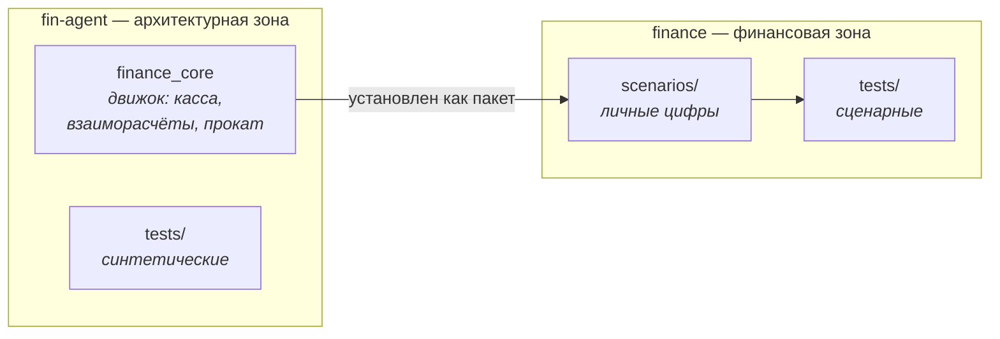

# Как работать с двумя зонами

## Главное правило: папка определяет правила

Пакет агента (`.omp/`) — **проектный**: он подхватывается из той папки, где
запущена сессия. Поэтому правила, команды и навыки зависят от того, **где открыт
агент**:

| Что делаем | Где открывать агента |
|---|---|
| Деньги: платежи, бюджет, реестр долгов, сценарии, план, письма | папка финансовой зоны (соседняя с этой, `../finance`) |
| Движок: правило расчёта, новая функция, тесты, база знаний архитектуры | папка архитектурной зоны (эта, где лежит `AGENTS.md`) |

Открыл в финансовой зоне — агент работает по её правилам (приватность, структура,
цикл) и видит команды `/ledger`, `/pay`, `/month`, `/plan`, `/ocr`, `/kb`, `/kb-map`.
Открыл в архитектурной — работает по правилам разработки и видит `/grilling`,
`/to-tickets`, `/ship`, `/code-review`, `/architecture`, `/kb`.

## Что где лежит

## Кто что меняет

- **Движок меняет только архитектурная зона.** Финансовая его не правит: увидел
  нужную правку в движке — это работа в другой зоне, а не «быстрый фикс на месте».
- **Данные и сценарии меняет только финансовая зона.** В движке нет ни одного
  личного числа — и не должно появиться.
- **Правило, найденное в финансовой зоне**, но не зависящее от личных цифр,
  переезжает в движок и запирается синтетическим тестом. Зависящее от цифр —
  остаётся в сценарии и запирается сценарным тестом.

## Не хватает функционала движка

Работая с деньгами, агент иногда видит, что движку не хватает возможности
(например, нужен прокат долгов на много месяцев вперёд). Порядок такой:

1. В финансовой зоне — `/need <чего не хватило>`. Команда проверяет, что дело
   именно в движке (а не в незаполненных данных или в том, что собирается
   сценарием), и записывает заявку в `fin-agent/inbox/`.
2. В архитектурной зоне — `/grilling` по этой заявке: потребность превращается в
   решение, из него рождается контракт плана.
3. Дальше обычный цикл: `/to-tickets` → `/ship` → синтетические тесты → сценарные
   тесты потребителя.
4. Заявка закрывается пометкой `> переработано: <куда>, <дата>` — файл остаётся
   как след.

**Почему не починить сразу.** Правка движка из финансовой зоны уходит без правил
разработки: без грилла, синтетических тестов и ревью. Заявка сохраняет знание,
а цикл разработки остаётся там, где для него есть процесс.

**Граница канала.** Финансовая зона пишет **только** в `inbox/`. Движок, тесты и
база знаний архитектурной зоны — её территория.

## Цикл изменения движка

1. Открыть агента в `fin-agent`.
2. Замысел → `/grilling` (или `/grill`, если записывать пока нечего).
3. Контракт плана → `docs/plans/<slug>.md`.
4. Тикеты → `/to-tickets`; выполнение → `/ship` по одному тикету.
5. Синтетические тесты движка: `python3 -m pytest tests/`.
6. **Сценарные тесты потребителя — это и есть интеграционный тест движка:**
   `cd ../finance && python3 tests/test_scenarios.py`.
7. База знаний: `python3 .omp/skills/kb-search/gitmark.py lint`.

## Установка движка

Движок поставлен как **редактируемый** пакет (`pip install -e`), поэтому правка в
`fin-agent/finance_core/` сразу видна в финансовой зоне — как в dev-окружении.
Отсюда правило: **после правки движка прогонять сценарные тесты потребителя** —
они и есть граница, за которой изменение становится заметным.

Запасной путь без установки: зона сама добавляет соседний каталог в `sys.path`
(переменная `FIN_AGENT_HOME` переопределяет путь, если зоны разъехались).

## Частые вопросы

**Где открывать агента для обычной работы с деньгами?**
В папке финансовой зоны — соседней с этой (`../finance`). Это рабочая папка по
умолчанию. Абсолютный путь зависит от машины; перенос на другую машину —
[../ops/перенос-на-другую-машину.md](../ops/перенос-на-другую-машину.md).

**А если нужно и то и другое сразу?**
Две сессии в двух папках — или одна, но помнить: правила действуют те, в чьей
папке открыта сессия. Пересекать границу можно, но правило из чужой зоны
применяется осознанно, а не по умолчанию.

**Как проверить, что всё цело?**
`python3 -m pytest tests/` в архитектурной зоне, `python3 tests/test_scenarios.py`
в финансовой, `gitmark lint` в обеих.
