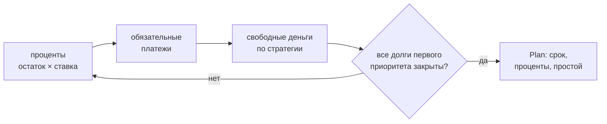

# finance_core

Ядро расчёта: **касса** и **долги**. Библиотека без состояния и без зависимостей —
только стандартная библиотека Python, деньги в `Decimal`. Личных данных не содержит:
все цифры приходят извне.

## Что считает

| Вопрос | Функция |
|---|---|
| Хватит ли денег в периоде, где дыра и когда | `run()` → `Result.hole`, `min_date` |
| Хватает ли остатка прожить до прихода | `run()` → `Result.floor_gap` |
| Сколько можно отдать частному кредитору | `optional_cap()` |
| Сколько стоит перекрыть дыру | `cover_cost()` |
| Сравнить варианты | `compare()` |
| Когда закроются долги и сколько стоят проценты | `roll_forward()` |
| Какая стратегия гашения дешевле | `compare_strategies()` |

## Касса (`solver.py`)

Модель: `Account` (счёт), `Income` (приход), `Payment` (**с указанием
финансирующего счёта**), `Transfer` (перевод между счетами), `Scenario`.
`run()` сортирует события по дате и ведёт бегущий остаток по каждому счёту.

Две разные величины — их нельзя путать:

- **дыра** (`Result.hole`) — уход основного счёта в минус;
- **нехватка до прожиточного минимума** (`Result.floor_gap`) — насколько остатка
  не хватает, чтобы прожить до следующего прихода:

$$ \text{требуется}(d) = F \times \frac{\text{дней до прихода}}{30}, \quad F = \text{прожиточный минимум в месяц} $$

Дыры может не быть, а нехватка быть. Если $F$ неизвестен — `floor_gap = None`
(«не оценено»), а не ноль.

## Долги (`debt.py`)

`Debt`: остаток, ставка (годовая или дневная), обязательный платёж, приоритет,
разрешена ли досрочка. `roll_forward()` катает месяцы:



- **Лавина** — свободные деньги идут на самую дорогую ставку; **снежный ком** —
  на самый маленький остаток.
- Освободившийся платёж не исчезает, а остаётся в бюджете (эффект снежного кома).
- `prepay=False` — долг получает только обязательный платёж; тогда видно, сколько
  денег **простаивает** (`Plan.idle`).
- `second_priority=True` — взыскания: вне графика, движок их не платит.
- Платёж меньше процентов → долг растёт, `Plan.stalled` вместо ложного срока.

## Инварианты

1. Правило счёта живёт в коде, а не в комментарии: «какой счёт финансирует платёж»
   — часть модели, а не примечание.
2. Неизвестное — `None`, не ноль. Подставленный ноль выдаёт выдуманную уверенность.
3. Ядро не знает ни одного личного числа: все цифры передаются снаружи.
4. Ноль зависимостей: только стандартная библиотека.

## Проверка

```bash
python3 -m pytest tests/     # синтетические фикстуры, без личных данных
```

Установка в проект-потребитель — `pip install -e .` из этого каталога либо
`PYTHONPATH` на него.
