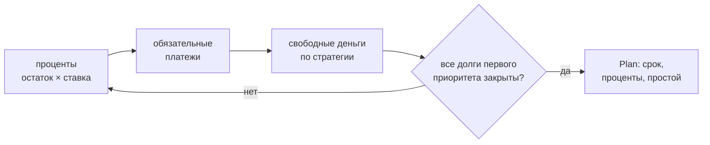
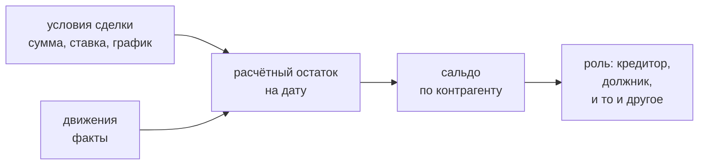

# finance_core

Ядро расчёта: **касса**, **долги** и **взаиморасчёты**. Библиотека без состояния и
без зависимостей — только стандартная библиотека Python, деньги в `Decimal`.
Личных данных не содержит: все цифры приходят извне.

## Что считает

| Вопрос | Функция |
|---|---|
| Хватит ли денег в периоде, где дыра и когда | `run()` → `Result.hole`, `min_date` |
| Хватает ли остатка прожить до прихода | `run()` → `Result.floor_gap` |
| Сколько можно отдать частному кредитору | `optional_cap()` |
| Сколько стоит перекрыть дыру | `cover_cost()` |
| Сравнить варианты | `compare()` |
| Когда закроются долги и сколько стоят проценты | `roll_forward()` |
| Какая стратегия гашения дешевле | `compare_strategies()` |
| Сколько я должен и сколько должны мне | `counterparty_balance()` |
| Сколько ещё не выплачено по сделке | `deal_balance()` |
| Кто контрагент: кредитор, должник или и то и другое | `counterparty_role()` |
| Сколько денег доступно сейчас | `liquidity()` |

## Касса (`solver.py`)

Модель: `Account` (счёт), `Income` (приход), `Payment` (**с указанием
финансирующего счёта**), `Transfer` (перевод между счетами), `Scenario`.
`run()` сортирует события по дате и ведёт бегущий остаток по каждому счёту.

Две разные величины — их нельзя путать:

- **дыра** (`Result.hole`) — уход основного счёта в минус;
- **нехватка до прожиточного минимума** (`Result.floor_gap`) — насколько остатка
  не хватает, чтобы прожить до следующего прихода:

$$ \text{требуется}(d) = F \times \frac{\text{дней до прихода}}{30}, \quad F = \text{прожиточный минимум в месяц} $$

Дыры может не быть, а нехватка быть. Если $F$ неизвестен — `floor_gap = None`
(«не оценено»), а не ноль.

## Долги (`debt.py`)

`Debt`: остаток, ставка (годовая или дневная), обязательный платёж, приоритет,
разрешена ли досрочка. `roll_forward()` катает месяцы:



- **Лавина** — свободные деньги идут на самую дорогую ставку; **снежный ком** —
  на самый маленький остаток.
- Освободившийся платёж не исчезает, а остаётся в бюджете (эффект снежного кома).
- `prepay=False` — долг получает только обязательный платёж; тогда видно, сколько
  денег **простаивает** (`Plan.idle`).
- `second_priority=True` — взыскания: вне графика, движок их не платит.
- Платёж меньше процентов → долг растёт, `Plan.stalled` вместо ложного срока.

## Взаиморасчёты (`settlements.py`)

`Settlements` — книга взаиморасчётов: контрагенты, кошельки, сделки, движения и
передачи долга. Сделка несёт условия (сумма, ставка, правило графика) и
направление; движение — факт: когда, сколько, куда и кому уплачено.



- **Ни остаток, ни сальдо не хранятся.** Обе величины считаются из условий и
  движений на дату — дату передаёт вызывающий, «сегодня» движок не спрашивает.
  Роль контрагента — тоже производная: её нет ни в одном поле.
- **Сальдо — отчётная величина.** Зачёт не производится: остатки по сделкам
  остаются своими, сальдо ничего не меняет. Оно показывает, сколько я должен ему
  минус сколько он мне.
- **Передача долга (цессия)** — запись истории: от кого к кому, когда, сколько
  было на момент передачи и насколько сумма изменилась. Запись задаёт версию
  условий; сумма сделки и последняя версия обязаны сходиться — это проверяет
  `validate()`, иначе у одного числа два носителя.
- **Кошелёк.** Остаток подписанный: минус на кредитном — долг, а не дыра; плюс —
  свои деньги (переплата). Свободный лимит показывается, но деньгами не
  считается; неизвестный лимит — `None`, а не ноль. Недоступный кошелёк
  (арестованный, с закрытым банком лимитом) в ликвидность не входит и свободного
  лимита не даёт: долг на нём гасят, а взять с него нельзя.
- **Сделка без суммы** — регулярный расход: платёж входит в обязательную
  нагрузку, но закрывать нечего, поэтому она не закрывается и досрочке не
  подлежит.
- **Движение против сделки** (возврат) увеличивает остаток; сумма движения всегда
  положительная — направление несёт само движение.
- **Новая форма живёт рядом со старой.** `Payment.creditor` (строка имени)
  продолжает работать; `Payment.counterparty` и `Payment.purpose` — новая форма.
  Ссылка на необъявленное — ошибка с перечнем объявленных, как для счетов.

## Инварианты

1. Правило счёта живёт в коде, а не в комментарии: «какой счёт финансирует платёж»
   — часть модели, а не примечание.
2. Неизвестное — `None`, не ноль. Подставленный ноль выдаёт выдуманную уверенность.
3. Ядро не знает ни одного личного числа: все цифры передаются снаружи.
4. Ноль зависимостей: только стандартная библиотека.
5. Остаток по сделке и сальдо по контрагенту — производные: у числа один носитель,
   второй — это уже расхождение.
6. Кошелёк: минус на кредитном — долг, плюс — свои деньги; свободный лимит
   показывается, но деньгами не считается, а у недоступного кошелька его нет —
   закрытый банком лимит взять нельзя, а долг гасится.

## Проверка

```bash
python3 -m pytest tests/     # синтетические фикстуры, без личных данных
```

Установка в проект-потребитель — `pip install -e .` из этого каталога либо
`PYTHONPATH` на него.
