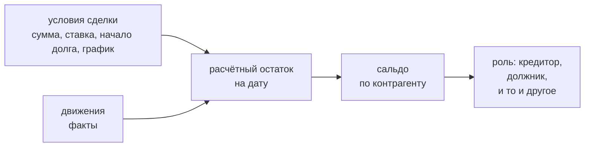
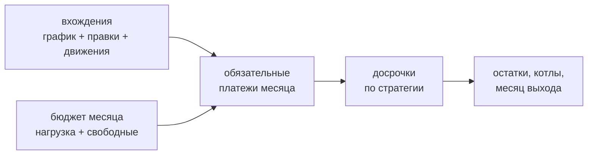
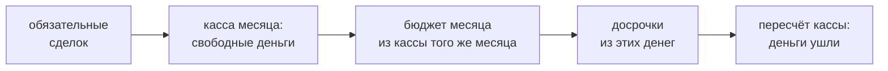
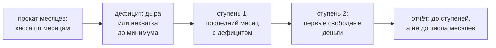
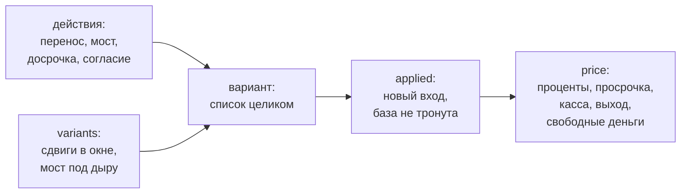

# finance_core

Ядро расчёта: **касса**, **взаиморасчёты**, **прокат сделок** и
**действия с ценой варианта**.
Библиотека без состояния и без зависимостей — только стандартная библиотека Python,
деньги в `Decimal`. Личных данных не содержит: все цифры приходят извне.

## Что считает

| Вопрос | Функция |
|---|---|
| Хватит ли денег в периоде, где дыра и когда | `run()` → `Result.hole`, `hole_date` |
| Что не прошло из-за ёмкости кошелька и что перевести | `run()` → `Result.unsecured`, `roll_cash()` → `CashMonth.unsecured` |
| Хватает ли остатка прожить до прихода | `run()` → `Result.floor_gap` |
| Сколько свободно и сколько можно отдать | `run()` → `Result.free`, `roll_cash()` → `CashMonth.free` |
| Сколько стоит перекрыть дыру | `cover_cost()` |
| Сравнить варианты | `compare()` → `Outcome.free` в конце линии |
| Каково сальдо: сколько я должен минус сколько должны мне | `counterparty_balance()` |
| Долг на дату: тело минус движения плюс начисленное | `deal_balance()` |
| Кто контрагент: кредитор, должник или и то и другое | `counterparty_role()` |
| Сколько денег доступно сейчас | `liquidity()` |
| Что и когда платится по графику сделки | `occurrences()` |
| Как считается дата вхождения: кламп на конец месяца и сдвиг с выходного (доход — назад, платёж — вперёд) | `planned_date()` |
| Когда закроются сделки и когда я выйду из долгов | `roll_deals()` |
| Какая стратегия досрочек дешевле | `compare_deal_strategies()` |
| Как прокатать кассу по месяцам | `roll_cash()` |
| Когда я выйду из долгов, считая вместе с кассой | `roll_months()` |
| До какого месяца заглядывает прокат и почему | `roll_window()` |
| Когда я вылезу из дефицита и когда появятся свободные деньги | `forecast()` |
| На сколько сдвинется прогноз от каждого неизвестного | `forecast_shifts()` |
| Что задаёт ширину вилки | `widest()` |
| Собрать вариант из действий и сравнить ценой | `baseline()` → `variants()` → `prices()` |
| Почему вариант невозможен, а не просто невыгоден | `impossible()` |
| Чем принятое действие становится в журнале | `facts()` |

## Касса (`solver.py`)

Модель: `Account` (счёт), `Income` (приход), `Payment` (**с указанием
финансирующего счёта**), `Transfer` (перевод между счетами), `Scenario`.
`run()` сортирует события по дате и ведёт бегущий остаток по каждому счёту.
В один день сначала приходит доход, потом уходит перевод, потом платёж: переводят
до того, как тратят.

**Кошелёк платит тем, что у него есть**
(`../docs/decisions/wallet-pays-what-it-has.md`). Платёж и перевод проверяются
ёмкостью своего счёта: собственный остаток — всегда, свободный лимит кредитного —
только под жизненный расход. Долговой платёж лимитом не финансируется, а
перевод — не платёж по долгу, и лимит к нему применим. Не хватило —
обязательство не проходит целиком (банк не списывает половину), досрочка проходит
настолько, насколько кошелёк может отдать, перевод не проходит вовсе. Непрошедшее
видно в `Result.unsecured`: дата, кошелёк, назначено, сколько не хватило и
подсказка, что перевести, — источником берётся кошелёк с наибольшим доступным
остатком. Движок переводов не создаёт: он говорит, что перевести, а перекладывает
деньги зона. Дыру движок не создаёт сам — она приходит снаружи, остатками, которые
уже в минусе. Дата отвечает на «когда началась», а не на «есть ли»: у стартовой
дыры — предшествующей первым событиям — в `run()` даты нет: окна нет и движок не
спрашивает «сегодня». Это одна половина общего правила даты стартовой дыры —
окно есть → `window_start` месяца, окна нет → `None` (вторая половина — в
описании `roll_cash()`). У кредитного с неизвестным лимитом ёмкость не оценена
(`None`), и отказа по неизвестному движок не выдумывает.

**Сумма события кассы положительная** — направление несёт само событие, а не
знак. Правило одно на оба носителя: во взаиморасчётах его держит `Movement`
(«сумма движения всегда положительная — направление несёт само движение»), в
кассе — `Payment`, `Transfer` и `Income`: неположительная сумма — ошибка с
понятным текстом, а не начисление денег. Остаток кошелька при этом остаётся
подписанным: минус на кредитном — долг, минус в данных — нехватка; правило про
суммы событий, а не про остатки.

`roll_cash()` катает ту же модель по календарным месяцам: остатки предыдущего —
вход следующего, тот же порядок дня, первый месяц неполный. Предохранитель
действует и здесь: непрошедшее видно в `CashMonth.unsecured`, а свободные деньги
месяца считаются без обещанного — непрошедшее обязательство не отменено. Из
свободных денег вычитается и **резерв обязательств**
(`Scenario.obligation_reserve`) — деньги, оставленные под платежи начала
следующего месяца: без него рвётся начало месяца, а величину порога задаёт зона,
не движок. У счёта есть признак доступности: недоступный в ликвидность не входит,
лимита к использованию не даёт и платёж финансировать не может — с закрытой банком
карты не заплатить, её можно только гасить; платить и переводить с него — ошибка,
а не тихий минус. Стартовая дыра месяца — предшествующая первым событиям —
датируется `window_start`: для первого месяца `start`, для остальных 1-е число —
окно известно, движок знает, когда месяц начался. Это вторая половина того же
общего правила даты стартовой дыры, что и в `run()`: одна формулировка, разный
повод (окно есть — дата есть, окна нет — даты нет). Неизвестный прожиточный
минимум даёт `floor_gap = None` («не оценено»), а не ноль.

Платёж с `prepaid=True` — досрочка: касса проводит её после обязательных
платежей месяца, поэтому свободные деньги считаются до неё. Месяц есть только у
`roll_cash()`; в `run()` досрочка идёт своей датой по общему порядку дня.

**Свободные деньги — состояние месяца, а не бюджет.** `CashMonth.free` —
доступные остатки минус накопленный по окну прожиточный минимум (все месяцы
окна до текущего включительно — прожитое прошлых месяцев остатки не теряют),
резерв обязательств и обещанное.
Сам минимум не включает события кассы: они уже уменьшили остаток и второй раз
не вычитаются (`../docs/decisions/floor-excludes-events.md`).
Величина подписана: когда нагрузка больше денег, она отрицательна — это нехватка,
а не деньги к раздаче. Бюджетом досрочек величина становится через
`CashMonth.prepay_budget` — те же свободные деньги, но не меньше нуля: бюджет
досрочек не бывает отрицательным, иначе нехватка уменьшала бы пул месяца.

**«Сколько свободно» и «сколько можно отдать» — одно число**
(`../docs/decisions/single-free-money-basis.md`). В линии (`run()`) это
`Result.free`: та же формула — деньги всех доступных кошельков минус
обещанное (назначенное и не прошедшее), минус накопленный прожиточный минимум
и минус резерв обязательств. **Сторона округления прожиточного минимума
выбрана и записана здесь: вверх до копейки** (`ROUND_CEILING`) — это
выбранная сторона ошибки: свободные деньги занижаются, а не завышаются,
и владелец не увидит свободного, которого нет. Вверх округляется и
накопленный по окну минимум, и прожитое отрезка — оба учёта одной стороны.
Точка отсчёта — первое событие линии, конец —
последнее: отрезок с включительными границами, `F × дней / 30` вверх до
копейки. Событий вовсе нет — отрезка нет и минимум не вычитается: точку
отсчёта движок не выдумывает («сегодня» он не спрашивает), а месяц в этом
случае копит минимум с начала окна как и раньше. Прежний потолок «сколько
можно отдать частному кредитору»
(`optional_cap()`) снесён: он мерил только основной кошелёк и не вычитал
прожиточный минимум — второй ответ на тот же вопрос. Порог резерва берётся
только из сценария (`Scenario.obligation_reserve`): отдельного аргумента у
`compare()` нет. Ограничение «с этой карты столько не уйдёт» остаётся
необеспеченностью с подсказкой перевода — это не второй ответ на вопрос
«сколько свободно».

Три разные величины — их нельзя путать:

- **дыра** (`Result.hole`) — нехватка денег суммарно по доступным кошелькам,
  «денег нет нигде»; `0` — нехватки нет;
- **необеспеченность** (`Result.unsecured`) — платёж, которому не хватило ёмкости
  своего кошелька: деньги есть, но не на нём. Платёж не проходит целиком, а лечится
  переводом; смешать это с дырой значит потерять причину;
- **нехватка до прожиточного минимума** (`Result.floor_gap`) — насколько остатка
  не хватает, чтобы прожить до следующего прихода:

$$ \text{требуется}(d) = F \times \frac{\text{дней до прихода}}{30}, \quad F = \text{прожиточный минимум в месяц} $$

«Остаток» в этой формуле — **совокупная доступная ликвидность всех кошельков**:
`wallet_money` по доступным кошелькам, тот же базис, что у дыры и свободных
денег: прожить на деньгах другого кошелька можно. Требование сравнивается не с
сырым остатком события, а с этой ликвидностью за вычетом **прожитого** —
минимума, уже прожитого с точки отсчёта до даты шага: прожитое уже
израсходовано, но остаток события его не терял. Прожитое считается той же
пропорцией $F \times \text{дней} / 30$ с округлением до копейки вверх.
`min_balance` и `end_balance` остаются метриками основного кошелька — это
разные величины, и названы они по-разному.

Точка отсчёта — одна из двух. **В прокате** (`roll_cash()`) это начало всего
окна: для первого месяца — сам `start`, далее начало месяца; прожито =
накопленный минимум месяцев окна до текущего (тот же счётчик, что в свободных
деньгах) плюс частичный текущий месяц до даты шага. **В `run()` окна нет** —
точка отсчёта первое событие линии, и прожито от него до даты шага, без
накопления: позиция до первого события неизвестна, движок не спрашивает
«сегодня» и её не выдумывает. Событие в самой точке отсчёта прожитого ещё не
имеет — нехватка считается как раньше.

**Точки оценки** — зеркало дыры. В прокате (`roll_cash()`) это вход каждого
месяца (ликвидность до событий) и каждое обязательное событие после него;
досрочка идёт после отложенного на жизнь и точкой не становится. Если приход
впереди виден, месяц без событий получает оценку по входу — число, а не «не
оценено». В `run()` — каждое событие линии. Приход в самый день входа считается
сегодняшним (0 дней впереди): голодать не перед чем, ликвидность дня оценивает
событие после прихода.

Дыры может не быть, а нехватка быть. Если $F$ неизвестен или прихода впереди
не видно — `floor_gap = None` («не оценено»), а не ноль.

## Взаиморасчёты (`settlements.py`)

`Settlements` — книга взаиморасчётов: контрагенты, кошельки, сделки, движения и
передачи долга. Сделка несёт условия (сумма, ставка, правило графика) и
направление; движение — факт: когда, сколько, куда и кому уплачено.



- **Ни остаток, ни сальдо не хранятся.** Обе величины считаются из условий и
  движений на дату — дату передаёт вызывающий, «сегодня» движок не спрашивает.
  Роль контрагента — тоже производная: её нет ни в одном поле.
- **Остаток сделки — один канон: «долг на дату» = тело − движения + начисленное**
  (`../docs/decisions/deal-balance-canon.md`). Тело берётся версией на эту дату
  (`deal_amount_at`), движения считаются до неё, начисленное — с начала долга
  (`Deal.start`) до конца дня; смена версии тела (дельта передачи) входит в базу
  начисления по своей дате. Начисление идёт **той же функцией**, что у
  проката, поэтому остаток проката на дату окна и расчётный остаток на ту же
  дату — одно число: прокат открывается тем же каноном (конец дня перед первым
  месяцем окна), а движения и передачи, случившиеся внутри окна, проводит в их
  месяц. **Участник копилки — не исключение:** его остаток падает платежами
  в котёл и равен расчётному остатку, как у любой сделки — пока единица
  открыта: после закрытия прокат обнуляет остатки участников разом, а канон
  на ту же дату ещё числит долг. «Закрывается разом» — правило единицы:
  единица закрыта, когда накоплено не меньше её цели, и тогда остатки
  участников обнуляются разом. Сам котёл считается от тел
  участников — проценты в копилку не копятся, цель от них не растёт. Ставки
  нет — начисления нет
  и канон сводится к «тело минус движения»; у регулярного расхода остатка нет
  (`None`).
- **Начало долга (`Deal.start`) — дата, с которой долг существует,** и от неё
  считается начисление. Обязательно для сделки со ставкой и суммой: без него
  «долг на дату» считать не от чего, и валидация падает с понятным текстом.
  У беспроцентной сделки и у регулярного расхода его не спрашивают. Это другой
  вопрос, чем `ScheduleRule.start` («начало ряда платежей»): ряд платежей
  начинается, когда начинаются платежи, долг существует раньше — и после их
  конца. Передача долга начала не двигает, дата позже начала окна — не ошибка:
  до неё баланс равен телу, начисленного нет.
- **Начисление процентов — производное и одно на всех.**
  `accrued_interest(deal, balance, since, until, payments, deltas)` понимает
  отрезок с включительными границами: сделка (ставки и база начисления), остаток
  на начало отрезка, границы, платежи отрезка и смены тела списком пар
  «дата — сумма». Дневная ставка по дням: платёж дня уменьшает остаток до
  начисления за этот день. Годовая — за месяц от остатка на начало месяца,
  платежи внутри месяца базу не двигают, отрезок внутри месяца идёт
  пропорционально дням, а смена тела входит в базу того же месяца. Каждое
  слагаемое округляется до копейки (`model.kopek`, `HALF_UP`). Правило
  начисления одно: прокат его вызывает — полный месяц частный случай отрезка, —
  а расчётный остаток (`deal_balance`) зовёт её от начала долга до даты, поэтому
  оба носителя сходятся по построению, а не совпадением.
- **Сальдо — отчётная величина.** Зачёт не производится: остатки по сделкам
  остаются своими, сальдо ничего не меняет. Оно показывает, сколько я должен ему
  минус сколько он мне.
- **Передача долга (цессия)** — запись истории: от кого к кому, когда, сколько
  было на момент передачи и насколько сумма изменилась. Запись задаёт версию
  условий; сумма сделки и последняя версия обязаны сходиться — это проверяет
  `validate()`, иначе у одного числа два носителя.
- **Кошелёк.** Остаток подписанный: минус на кредитном — долг, а не дыра; плюс —
  свои деньги (переплата). Свободный лимит показывается, но деньгами не
  считается; неизвестный лимит — `None`, а не ноль. Недоступный кошелёк
  (арестованный, с закрытым банком лимитом) в ликвидность не входит и свободного
  лимита не даёт: долг на нём гасят, а взять с него нельзя. Из этих правил
  складывается **ёмкость** — сколько кошелёк может отдать под платёж; правило одно
  на оба носителя (`model.wallet_money`, `wallet_free_limit`, `wallet_capacity`) и
  на оба пути — кассу и прокат.
- **Свободный лимит идёт только под жизненный расход.** Долговой платёж лимитом
  не платится: банк закрывает лимит для погашения кредитов, и прогноз, построенный
  на такой оплате, радужный, а о запрете владелец узнаёт от банка, а не от движка.
  Признак несёт `Payment.debt` — по умолчанию долговой: ошибка в сторону запрета
  даёт пессимистичный прогноз, в сторону разрешения — радужный. Берётся он из
  модели: у сделки с остатком платёж долговой, у регулярного расхода — жизненный
  (`ScheduledPayment.debt`), досрочка долговая всегда (`debt=False` у неё —
  ошибка), а у разового платежа зоны признак свой. Перевод — не платёж по долгу:
  лимит к нему применим.
- **Сделка без суммы** — регулярный расход: платёж входит в обязательную
  нагрузку, но закрывать нечего, поэтому она не закрывается и досрочке не
  подлежит.
- **Движение против сделки** (возврат) увеличивает остаток; сумма движения всегда
  положительная — направление несёт само движение.
- **Правило графика порождает вхождения.** `ScheduleRule` — закрытый набор форм:
  фиксированная сумма с числом платежей (`payment`, `count`), минимальный платёж процентом от
  остатка (`percent`), несколько дней в месяце (`days`), отдельный первый платёж
  (`first`). Вхождение правится поверх правила правками журнала
  (`OccurrenceEdit` — перенести, пропустить, сменить сумму), а не правкой самого
  правила; состояние вхождения (`occurrences`) производно от правила, правок и
  движений.
- **Факт по вхождению несёт движение.** `Movement.occurrence` — плановая дата
  вхождения, которое движение закрывает; вхождение исполнено, когда по нему есть
  движение, а фактическая дата — дата закрывающего движения. Движение без ссылки
  вхождение не закрывает: это досрочка или платёж вне графика.
- **Фактический остаток — наблюдение извне.** `ObservedBalance` — остаток сделки на
  дату, введённый руками из выписки: он не заменяет расчёт (`deal_balance`), а
  сверяется с ним. Расхождение — не ошибка файла, а незакрытый вопрос: закрывается
  записью недостающих данных, а не правкой числа. Проверка падает только на
  невозможном (отрицательная сумма, наблюдение по регулярному расходу), а само
  расхождение видно открытым вопросом прогноза
  (`../docs/decisions/derived-balances.md`).
- **Платёж называет контрагента.** `Payment.counterparty` — уид контрагента,
  `Payment.purpose` — назначение. Объявленность ссылок проверяет книга: сделка,
  движение, канал и получатель выгоды — ошибка с перечнем объявленных, как для
  счетов. Касса сверяет только счета и требует, чтобы платёж назвал контрагента;
  объявленность контрагента она не проверяет — реестра контрагентов у `Scenario`
  нет, данные приходят от загрузчика уже собранными.

## Прокат сделок (`roll.py`)

`roll_deals()` катает сделки по месяцам от переданной даты: проценты по базе
начисления, обязательные вхождения по графику, свободные деньги по стратегии.
Деньги по дням внутри месяца считает касса — прокат сделок отдаёт ей расписание
(`DealMonth.payments`), а обратно получает бюджет досрочек; чередует шаги сторон
драйвер прохода по месяцам с явным состоянием каждой из них
(`schedule-to-cash.md`, `month-by-month-convergence.md`).



- **Платит только то, что должен я.** Требования («мне должны») в прокат не входят:
  они идут отдельным списком (`expectations`) и в кассу не подмешиваются.
- **Освободившийся платёж остаётся в бюджете.** Бюджет месяца — обязательная
  нагрузка, посчитанная на начало проката, плюс свободные деньги: закрылась сделка
  раньше срока — её платёж уходит другим. Это и есть снежный ком.
- **Урезанный обязательный платёж виден числом.** Вхождение платится
  `min(want, room, pool)`; когда `want` больше, недоплата месяца названа
  числом (`DealMonth.short` — сумма `want − amount` по обязательным
  вхождениям): урезал пул, остаток или котёл — видно одно и то же число.
  Бюджет при этом не пересчитывается — он зафиксирован на старте, — а
  аррерис не накапливается: `paid` и пул месяца не меняются.
- **Копилка.** Сделки одной единицы закрытия гасят друг друга вместе: платежи
  копятся в котёл и падают в остаток участника — его остаток канон, как у
  любой сделки. «Закрывается разом» — правило единицы: закрыта, когда
  накоплено не меньше её цели, и тогда остатки участников обнуляются разом.
  Цель (сумма тел участников на открытие окна плюс дельты передач внутри
  окна) фиксирована при договорённости и не растёт — процентов внутри
  копилки нет: они идут в остаток участника, а не в котёл. Ставка копилки —
  максимальная ставка участника; она
  участвует только в ранжировании (`_order`), на суммы не влияет.
- **Досрочка идёт по стратегии, но сделку можно из неё исключить.**
  `Deal.prepay=False` — свободные деньги эту сделку не трогают, её платежи идут
  своим графиком, а деньги уходят следующей по порядку. Так помечают револьверную
  кредитку: закрывать её досрочкой бессмысленно — лимит освобождает минимальный
  платёж и снова тратится. Признак — про сделку, а не про стратегию: стратегия
  говорит, чью ставку гасить первой — у копилки это максимальная ставка
  участника. Копилка досрочится вся целиком, поэтому запрет любого её
  участника запрещает и копилку — иначе запрет обошли бы через единицу
  закрытия.
- **Второй приоритет сам не платится.** Показывается **срез свободных денег
  месяца** — сколько их не нашлось места (`DealMonth.offer`: свободные деньги
  месяца минус ушедшие досрочки; в связке — `CashMonth.free`, в прокате без
  кассы — переданный бюджет) — и предложение направить их туда; погашение
  считается только после согласия владельца (`consent_to_second`). Согласие
  считается до конца: прокат
  идёт, пока не закроется и второй приоритет, — иначе даты его закрытия не видно
  (`DealRoll.second_freedom`). Взыскание, попавшее в единицу закрытия, гасится
  вместе с ней первым приоритетом — тогда дата видна и без согласия. Ждать при
  этом не бесплатно: долг растёт по ставке сделки.
- **База начисления решает, стоит ли перенос денег.** Дневная ставка считается по
  дням — платёж дня уменьшает остаток до начисления за этот день, поэтому перенос
  внутри месяца стоит дни × дневная ставка. Годовая начисляется за месяц: перенос
  внутри месяца её не удорожает. Правило само живёт одной функцией в `settlements`
  (`accrued_interest`): прокат передаёт ей месяц целиком — остаток на его начало
  и платежи месяца, — и берёт число как есть, второй раз проценты не округляя.
- **Пробел — не ноль.** Сделка с неизвестной ставкой, без правила графика, без
  суммы платежа или без финансирующего кошелька в прокат не входит и перечисляется
  пробелом (`gaps`); платёж меньше начисляемых процентов даёт `stalled` вместо
  ложного срока. Требованию без графика тоже нечего показать: это пробел, а не
  пустая строка.
- **У вопроса «когда выйду из долгов» два названных ответа, и обе даты в
  прокате.** `DealRoll.payoff_by_graph` — **срок по графику**: тот же прокат с
  нулевым бюджетом досрочек и до `max_months` — окном кассы не сужается, поэтому
  есть у любого графика и это гарантированный верх. `DealRoll.freedom` — **срок с
  досрочками**: при текущем бюджете свободных денег; он лежит не позже графика, а
  за концом окна не выдумывается. Вторая дата считается всегда, без флага. Не
  закрылось — причиной рядом с датой (`payoff_by_graph_reason`):
  `PAYOFF_NOT_CLOSED` («за отведённые месяцы долг не закрылся») либо
  `PAYOFF_CLOSED_BEFORE` («закрыт к началу проката: закрывать нечего») с первым
  месяцем окна вместо даты. Платёж, не покрывающий проценты, поэтому даёт честное
  «не закрывается», а не пропуск: прокат доходит до предела месяцев на любом
  графике.
- **Просроченное платится в первый месяц проката.** Дат в прошлом в расписании не
  бывает: вхождение, чей срок прошёл, уходит в первый месяц — в свой день месяца,
  но не раньше начала проката. Долг от этого не меняется: он и так в остатке.
- Регулярный расход платится, но не закрывается и не досрочится: на месяц выхода
  он не влияет.
- **Досрочка — тоже платёж.** Она уходит в расписание платежом без вхождения
  (`planned=None`): деньги покидают кассу, и касса обязана это видеть — иначе
  остаток завышен на всё уплаченное сверх графика.

## Прокат месяцев (`roll.py`)

`roll_months()` идёт **месяц за месяцем**: драйвер чередует шаги сторон, и каждая
получает шаг календарного месяца плюс явное состояние между вызовами. У сделок
это открытые остатки, котлы и зафиксированная нагрузка (`_DealsRoll`), у кассы —
остатки кошельков, накопленный минимум и непрошедшее (`_CashRoll`, `_CashMonth`).
Стороны друг о друге не знают: бюджет месяца касса отдаёт сделкам шагом, а не
обратным вызовом (`../docs/decisions/schedule-to-cash.md`,
`../docs/decisions/month-by-month-convergence.md`).

Порядок внутри месяца строг — обязательные → касса → досрочки → пересчёт кассы:



- **Окно кончается там, где кончается вопрос.** Окно проката (`roll_window`) —
  минимум из трёх: последний платёж по сделкам с остатком (по графику —
  гарантированный верх: досрочки закрывают долг раньше, но никогда позже), конец
  видимых доходов (`income_horizon`) и `max_months`. Регулярный расход окно не
  продлевает: остатка у него нет. Сделка без числа платежей границы по долгам не
  даёт вовсе — её ряд не кончается, и для неё предел — доходы и `max_months` (в
  смешанном портфеле окно тоже упирается в них, а не в график короткого долга).
  Второй приоритет продлевает окно только при согласии владельца. Причина конца
  окна — одно значение объявленного набора (`WINDOW_REASONS`) по порядку важности:
  «долги закрыты» → «кончились доходы» → «кончился предел месяцев»; она видна
  снаружи (`DealRoll.window`, `MonthsRoll.window`, `Forecast.window`). Ступень за
  окном назван «не достигнута за окно» с этой причиной, а дата за окном говорит
  своим словом: обе даты долгов делят одну фразу `PAYOFF_NOT_CLOSED` («за
  отведённые месяцы долг не закрылся») и добавляют после неё причину конца окна;
  «второй приоритет не закрылся за окно» и «на подушку не хватило за окно» —
  отдельные вопросы. Касса катается по тому же
  окну, что и долги, — иначе окно кончалось бы не там, где кончился вопрос.
  Готовое окно можно передать снаружи (`window`): цена варианта считает вариант в
  окне базы — сравнение идёт по одной линии; переданное окно обязано быть посчитано
  по той же книге и с тем же согласием, иначе отчёт разойдётся с книгой.
- **Бюджет месяца приходит из кассы того же месяца, а не из прошлого.** Правка
  бюджета не раскатывается вперёд на десятки итераций: связка сходится по
  построению и стоит одного прохода по графику, поэтому длинный график (окно в
  сотни месяцев) считается за линейное по месяцам время.
- **Внутри месяца сходимость остаётся, и у неё малый предел.** Бюджет месяца,
  непрошедшее и свободные деньги связаны через обещанное: непрошедший платёж не
  отменён, деньги на него уже обещаны. Круг «обязательные → касса» повторяется,
  пока бюджет не перестанет меняться; за `_MONTH_PASSES` (10) шагов не сошлось —
  это патология внутри месяца, а не длинного графика: срабатывает
  `ConvergenceError` (предохранитель), драйвер ловит его и помечает месяц.
- **Признак несходимости живёт в результате, а расчёт не роняется исключением.**
  Месяцы, не сошедшиеся за предел, видны в `MonthsRoll.unconverged` (признак —
  `converged`), тот же список уходит в `Forecast` и делает его неполным
  (`Forecast.complete`) — в один ряд с `stalled` и `assumed`.
- **Публичного предела итераций нет.** У зоны один предел — `max_months`:
  `roll_months()` и `ForecastInput` параметра `max_iterations` больше не знают.
- **Срок по графику считается один раз.** Второй проход (без досрочек) живёт
  рядом с основным (`_graph_pass`), а не повторяется на каждой сходимости.
- **Бюджет досрочек не бывает отрицательным.** В бюджет идёт
  `CashMonth.prepay_budget`, а не `free`: отрицательные свободные деньги —
  нехватка, и пул месяца они не уменьшают. Поэтому связка сходится и когда
  прожиточный минимум неизвестен, а денег не хватает: нехватка видна
  необеспеченностью и дырой, а не `ConvergenceError`.
- **Дыра не останавливает прокат.** Месяцы после неё помечаются как посчитанные
  на допущении (`assumed`): прокат не останавливается и не уходит в минус молча.
- **Досрочка, которой не хватило кошелька сделки, не проходит.** Бюджет досрочек
  считается по всем кошелькам — владелец видит свои деньги целиком, — но уходит
  досрочка только с кошелька сделки: недосягаемое видно необеспеченностью с
  подсказкой, что перевести. Прокат сделок при этом считает, что платёж пройдёт, —
  значит, прогноз долгов условен: он верен при условии, что перевод сделан.
  Условие называет `MonthsRoll.unsecured_total` и `cash_months`: сколько не прошло,
  когда и с какого кошелька перевести. Переводы на весь горизонт даёт зона — её это
  обязанность, а не движка.

## Прогноз (`forecast.py`)

`forecast()` отвечает на вопрос владельца **набором** дат, а не одной
(`../docs/decisions/what-means-out.md`): ступень 1 — позади последний месяц с
дефицитом, ступень 2 — первый месяц со свободными деньгами. Плюс даты по
приоритетам и подушке.



- **Отчёт идёт до момента, когда ступени достигнуты**, а не до фиксированного числа
  месяцев. Не достигнуты — сказано прямо: ступень называет причину (`reason`), а не
  показывает последнюю цифру проката.
- **Ступень 1 — про устойчивость, а не про один удачный месяц.** Она держится на
  **последнем** месяце с дефицитом — дырой или нехваткой до прожиточного минимума
  (`Deficit`), — а не на первом спокойном.
- **Ступень 2 — сверх ступени 1**: свободные деньги считаются до досрочек (они же и
  есть бюджет досрочек), но не раньше, чем позади окажется последний месяц с
  дефицитом. Иначе отчёт кончался бы раньше своего же дефицита и ступень 1 осталась
  бы без него.
- **Неизвестное не подставляется нулём.** Без прожиточного минимума ступени не
  измерены, а прогноз помечен неполным (`Forecast.complete`); не измерена и нехватка
  в месяце, до которого не видно прихода, — «не оценено» отсутствием дефицита не
  объявляется, и ступень 1 тогда не выдаётся за достигнутую. Пробелы
  (`DealRoll.gaps`) и открытые вопросы тоже делают прогноз неполным.
- **Неизвестные разбираются по одному.** `forecast_shifts()` считает базу плюс сдвиг
  даты от каждого параметра **отдельно** — комбинированная вилка смешала бы причины,
  и не было бы видно, что задаёт ширину; называет её `widest()`.
- **Отдельные строки отчёта.** Требования (`expectations`) в кассу не подмешиваются,
  но видно, закрыло бы требование дыру (`Deficit.covers_hole`); передача внутри
  семьи (`family`) — отдельной строкой с детализацией: разовый платёж называет, на
  что ушли деньги, платёж по графику — кому и сколько (у сделки назначения не
  бывает); необъяснённое расхождение факта с расчётом (`questions`) — открытый
  вопрос, а не тишина.
- **Допущение — не факт.** Месяцы после дыры помечены (`assumed`): цифра на
  допущении не выглядит фактом. Прогноз долгов при непрошедшем платеже условен — и
  это тоже видно числом (`unsecured_total`).
- **Подушка — цель, а не расход**: из свободных денег она не вычитается; цель
  достигнута, когда свободных денег на руках хватает (`cushion`), и считается это по
  всему прокату, как и даты по приоритетам. Суммой по месяцам накопление не
  считается: свободные деньги — остаток, а не поток.
- **Две даты одного вопроса — не взаимозаменяемы.** `first_priority` — срок с
  досрочками при текущем бюджете (`Milestone`: месяц либо причина),
  `payoff_by_graph` — срок по графику (гарантированный верх, окном не сужается);
  обе приходят из проката, а не считаются отдельно. Названия различимы по одному
  признаку: «по графику» — без досрочек, приоритет — с ними.

## Действия и цена варианта (`actions.py`)

`baseline()` считает базу — прогноз исходного сценария и горизонт проката, — а дальше
варианты сравниваются с ней: `impossible()` называет причину, по которой вариант
невозможен, `applied()` собирает вход варианта, `price()` считает цену, `variants()`
перебирает узкий набор сам.



- **Действие — объект**: `Move` (перенести платёж на дату; без даты — отложить),
  `Bridge` (мост на N дней под ставку), `Prepay` (досрочка из свободных денег
  месяца), `Direct` (направить свободные деньги — согласие владельца на второй
  приоритет). Вариант — список действий (`Variant`), применяемый **целиком**: прокат
  идёт месяц за месяцем через весь список разом, а не заново после каждого действия.
- **Сценарий под вариант не переписывается.** `applied()` собирает новый вход, база
  остаётся как была, — поэтому вариантов можно посчитать сколько угодно от одной базы.
- **Действие живёт в окне базы.** `Base.horizon` — конец окна проката, а не
  `max_months`: окно может быть короче предела месяцев, и тогда сдвиг за окно
  объявляется невозможным. Вариант считается в том же окне (кроме случая, когда
  действие меняет входы окна, — согласие владельца), поэтому цена сравнивает одну
  линию, а не разные.
- **Отклоняется только невозможное**: сдвиг за горизонт, мост без дыры, мост больше
  доступного лимита кошелька, досрочка больше остатка сделки, конфликт действий
  внутри варианта. Бюджет досрочки — невозможность по числу, но меряется он не по
  базе, а по **входу варианта**: база плюс все действия, кроме всех досрочек —
  перенос, освободивший деньги месяца, идёт в зачёт, вместе — Σ ≤ бюджета входа,
  и порядок действий не влияет; месяц за окном входа — «за отчётом», а не нулевой
  бюджет. Невыгодное не отклоняется — оно показывается ценой,
  а решение принимает человек.
- **Цена — набор измерений**, а не одно число: рубли процентов, дни просрочки, дыра
  (худшая глубина, дата начала, сколько месяцев держится), необеспеченность (вариант
  может пообещать деньги, которых на кошельке нет), сдвиг дат выхода и ступеней,
  свободные деньги последнего месяца окна. Цена моста считается по переданной
  ставке, цена переноса — по базе начисления сделки: у дневной это рубли, у годовой —
  только дни. Свободные деньги — остаток, а не поток: суммой по месяцам одни и те же
  деньги посчитались бы столько раз, сколько месяцев в окне.
- **Принятое действие становится фактом** (`facts`): правкой вхождения, движением по
  сделке или новой сделкой. Объект-действие в данных не хранится.
- **Досрочка по сделке из копилки** гасит её как обычное движение: участник
  закрывается, а единица остаётся открытой, пока не закрыты остальные её сделки, —
  копилка закрывается разом, и одной сделкой её не закрыть.
- **Мост — не отдельная сущность**, а новая сделка с условиями и деньги в кассе:
  сумма к возврату считается по переданной ставке, возврат идёт по графику сделки.
  Ставка у сделки нулевая — дневное начисление проката считает месяц целиком, и мост,
  взятый в середине месяца, удорожило бы. Возврат моста — долговой платёж: лимитом
  кошелька он не платится, и кошелёк обязан иметь свои деньги.
- **Перебор узкий**: сдвиги платежей в окне вокруг первой дыры (на дату ближайшего
  прихода) и мост под саму дыру. Ставка и кошелёк приходят снаружи, окно сдвигов
  задаётся снаружи — в движке только умолчание 7 дней. Невозможное в набор не
  попадает.

## Инварианты

1. Правило счёта живёт в коде, а не в комментарии: «какой счёт финансирует платёж»
   — часть модели, а не примечание.
2. Неизвестное — `None`, не ноль. Подставленный ноль выдаёт выдуманную уверенность.
3. Ядро не знает ни одного личного числа: все цифры передаются снаружи.
4. Ноль зависимостей: только стандартная библиотека.
5. Остаток по сделке и сальдо по контрагенту — производные: у числа один носитель,
   второй — это уже расхождение.
6. Кошелёк: минус на кредитном — долг, плюс — свои деньги; свободный лимит
   показывается, но деньгами не считается, а у недоступного кошелька его нет —
   закрытый банком лимит взять нельзя, а долг гасится.
7. Факт по вхождению несёт движение: деньги и «этот платёж сделан» — одна запись,
   а не две. Движение без ссылки вхождение не закрывает.
8. Досрочка — платёж расписания: деньги, ушедшие из кассы, касса обязана видеть.
   Свободные деньги считаются до неё — иначе один и тот же рубль сочтён дважды.
9. Кошелёк платит тем, что у него есть: платёж не выходит за ёмкость своего счёта,
   а непрошедшее видно необеспеченностью. Дыра от этого не появляется — она
   приходит снаружи.
10. Вариант не переписывает сценарий: действия применяются к копии, база остаётся
    как была, — иначе сравнение вариантов сравнивало бы разное.

## Проверка

Команды выполняются из корня репозитория — там `pyproject.toml` и `tests/`, а не
рядом с этим README:

```bash
python3 -m pytest tests/     # синтетические фикстуры, без личных данных
```

Установка в проект-потребитель — `pip install -e .` из корня репозитория либо
`PYTHONPATH` на каталог `finance_core/`.
