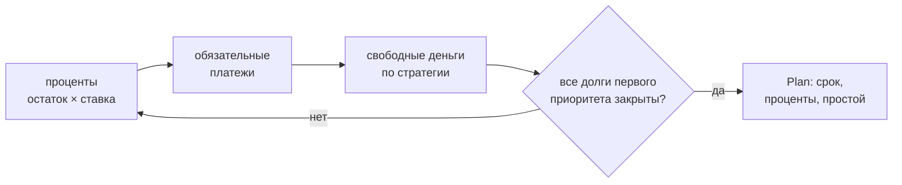
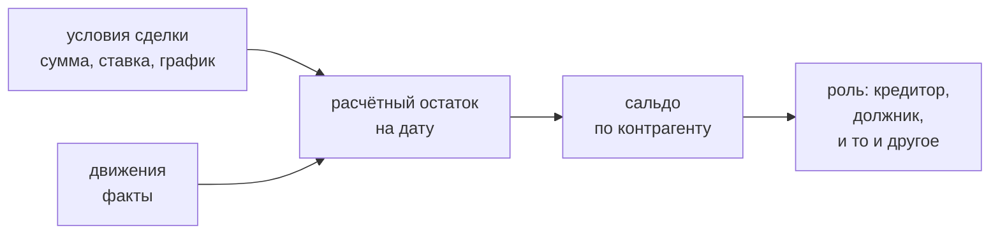
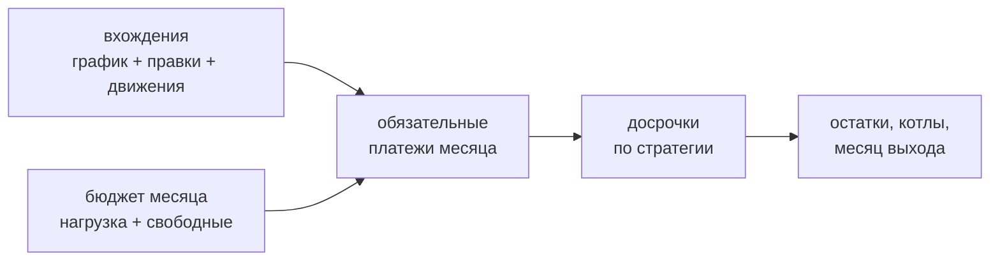
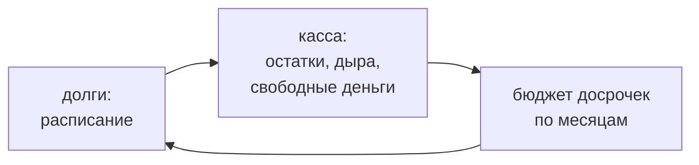

# finance_core

Ядро расчёта: **касса**, **долги**, **взаиморасчёты** и **прокат сделок**.
Библиотека без состояния и без зависимостей — только стандартная библиотека Python,
деньги в `Decimal`. Личных данных не содержит: все цифры приходят извне.

## Что считает

| Вопрос | Функция |
|---|---|
| Хватит ли денег в периоде, где дыра и когда | `run()` → `Result.hole`, `min_date` |
| Хватает ли остатка прожить до прихода | `run()` → `Result.floor_gap` |
| Сколько можно отдать частному кредитору | `optional_cap()` |
| Сколько стоит перекрыть дыру | `cover_cost()` |
| Сравнить варианты | `compare()` |
| Когда закроются долги и сколько стоят проценты | `roll_forward()` |
| Какая стратегия гашения дешевле | `compare_strategies()` |
| Сколько я должен и сколько должны мне | `counterparty_balance()` |
| Сколько ещё не выплачено по сделке | `deal_balance()` |
| Кто контрагент: кредитор, должник или и то и другое | `counterparty_role()` |
| Сколько денег доступно сейчас | `liquidity()` |
| Что и когда платится по графику сделки | `occurrences()` |
| Как считается дата платежа: кламп на конец месяца и сдвиг с выходного | `planned_date()` |
| Когда закроются сделки и когда я выйду из долгов | `roll_deals()` |
| Какая стратегия досрочек дешевле | `compare_deal_strategies()` |
| Как прокатать кассу по месяцам | `roll_cash()` |
| Когда я выйду из долгов, считая вместе с кассой | `roll_months()` |

## Касса (`solver.py`)

Модель: `Account` (счёт), `Income` (приход), `Payment` (**с указанием
финансирующего счёта**), `Transfer` (перевод между счетами), `Scenario`.
`run()` сортирует события по дате и ведёт бегущий остаток по каждому счёту.

`roll_cash()` катает ту же модель по календарным месяцам: остатки предыдущего —
вход следующего, доходы раньше платежей в один день, первый месяц неполный.
У счёта есть признак доступности: недоступный в ликвидность не входит, лимита к
использованию не даёт и платёж финансировать не может — с закрытой банком карты
не заплатить, её можно только гасить. Неизвестный прожиточный минимум даёт
`floor_gap = None` («не оценено»), а не ноль.

Платёж с `prepaid=True` — досрочка: касса проводит её после обязательных
платежей месяца, поэтому свободные деньги считаются до неё. Это и есть бюджет
досрочек, который касса возвращает долговой стороне.

Две разные величины — их нельзя путать:

- **дыра** (`Result.hole`) — уход основного счёта в минус;
- **нехватка до прожиточного минимума** (`Result.floor_gap`) — насколько остатка
  не хватает, чтобы прожить до следующего прихода:

$$ \text{требуется}(d) = F \times \frac{\text{дней до прихода}}{30}, \quad F = \text{прожиточный минимум в месяц} $$

Дыры может не быть, а нехватка быть. Если $F$ неизвестен — `floor_gap = None`
(«не оценено»), а не ноль.

## Долги (`debt.py`)

`Debt`: остаток, ставка (годовая или дневная), обязательный платёж, приоритет,
разрешена ли досрочка. `roll_forward()` катает месяцы:



- **Лавина** — свободные деньги идут на самую дорогую ставку; **снежный ком** —
  на самый маленький остаток.
- Освободившийся платёж не исчезает, а остаётся в бюджете (эффект снежного кома).
- `prepay=False` — долг получает только обязательный платёж; тогда видно, сколько
  денег **простаивает** (`Plan.idle`).
- `second_priority=True` — взыскания: вне графика, движок их не платит.
- Платёж меньше процентов → долг растёт, `Plan.stalled` вместо ложного срока.

## Взаиморасчёты (`settlements.py`)

`Settlements` — книга взаиморасчётов: контрагенты, кошельки, сделки, движения и
передачи долга. Сделка несёт условия (сумма, ставка, правило графика) и
направление; движение — факт: когда, сколько, куда и кому уплачено.



- **Ни остаток, ни сальдо не хранятся.** Обе величины считаются из условий и
  движений на дату — дату передаёт вызывающий, «сегодня» движок не спрашивает.
  Роль контрагента — тоже производная: её нет ни в одном поле.
- **Сальдо — отчётная величина.** Зачёт не производится: остатки по сделкам
  остаются своими, сальдо ничего не меняет. Оно показывает, сколько я должен ему
  минус сколько он мне.
- **Передача долга (цессия)** — запись истории: от кого к кому, когда, сколько
  было на момент передачи и насколько сумма изменилась. Запись задаёт версию
  условий; сумма сделки и последняя версия обязаны сходиться — это проверяет
  `validate()`, иначе у одного числа два носителя.
- **Кошелёк.** Остаток подписанный: минус на кредитном — долг, а не дыра; плюс —
  свои деньги (переплата). Свободный лимит показывается, но деньгами не
  считается; неизвестный лимит — `None`, а не ноль. Недоступный кошелёк
  (арестованный, с закрытым банком лимитом) в ликвидность не входит и свободного
  лимита не даёт: долг на нём гасят, а взять с него нельзя.
- **Сделка без суммы** — регулярный расход: платёж входит в обязательную
  нагрузку, но закрывать нечего, поэтому она не закрывается и досрочке не
  подлежит.
- **Движение против сделки** (возврат) увеличивает остаток; сумма движения всегда
  положительная — направление несёт само движение.
- **Правило графика порождает вхождения.** `ScheduleRule` — закрытый набор форм:
  фиксированная сумма с числом платежей (`payment`, `count`), минималка процентом от
  остатка (`percent`), несколько дней в месяце (`days`), отдельный первый платёж
  (`first`). Вхождение правится поверх правила правками журнала
  (`OccurrenceEdit` — перенести, пропустить, сменить сумму), а не правкой самого
  правила; состояние вхождения (`occurrences`) производно от правила, правок и
  движений.
- **Факт по вхождению несёт движение.** `Movement.occurrence` — плановая дата
  вхождения, которое движение закрывает; вхождение исполнено, когда по нему есть
  движение, а фактическая дата — дата закрывающего движения. Движение без ссылки
  вхождение не закрывает: это досрочка или платёж вне графика.
- **Новая форма живёт рядом со старой.** `Payment.creditor` (строка имени)
  продолжает работать; `Payment.counterparty` и `Payment.purpose` — новая форма.
  Ссылка на необъявленное — ошибка с перечнем объявленных, как для счетов.

## Прокат сделок (`roll.py`)

`roll_deals()` катает сделки по месяцам от переданной даты: проценты по базе
начисления, обязательные вхождения по графику, свободные деньги по стратегии.
Деньги по дням внутри месяца считает касса — прокат сделок отдаёт ей расписание
(`DealMonth.payments`), а обратно получает бюджет досрочек; связывает их
функция-композиция без состояния (`schedule-to-cash.md`).



- **Платит только то, что должен я.** Требования («мне должны») в прокат не входят:
  они идут отдельным списком (`expectations`) и в кассу не подмешиваются.
- **Освободившийся платёж остаётся в бюджете.** Бюджет месяца — обязательная
  нагрузка, посчитанная на начало проката, плюс свободные деньги: закрылась сделка
  раньше срока — её платёж уходит другим. Это и есть снежный ком.
- **Копилка.** Сделки одной единицы закрытия гасят друг друга вместе: платежи
  копятся в котёл, остаток не падает, цель фиксирована и не растёт — процентов
  внутри копилки нет.
- **Второй приоритет сам не платится.** Показывается свободный остаток и
  предложение (`offer`) направить его туда; погашение считается только после
  согласия владельца (`consent_to_second`). Ждать при этом не бесплатно: долг
  растёт по ставке сделки.
- **База начисления решает, стоит ли перенос денег.** Дневная ставка считается по
  дням — платёж дня уменьшает остаток до начисления за этот день, поэтому перенос
  внутри месяца стоит дни × дневная ставка. Годовая начисляется за месяц: перенос
  внутри месяца её не удорожает.
- **Пробел — не ноль.** Сделка с неизвестной ставкой, без правила графика или без
  суммы платежа в прокат не входит и перечисляется пробелом (`gaps`); платёж
  меньше начисляемых процентов даёт `stalled` вместо ложного срока. Требованию
  без графика тоже нечего показать: это пробел, а не пустая строка.
- **Просроченное платится в первый месяц проката.** Дат в прошлом в расписании не
  бывает: вхождение, чей срок прошёл, уходит в первый месяц — в свой день месяца,
  но не раньше начала проката. Долг от этого не меняется: он и так в остатке.
- Регулярный расход платится, но не закрывается и не досрочится: на месяц выхода
  он не влияет.
- **Досрочка — тоже платёж.** Она уходит в расписание платежом без вхождения
  (`planned=None`): деньги покидают кассу, и касса обязана это видеть — иначе
  остаток завышен на всё уплаченное сверх графика.

## Прокат месяцев (`roll.py`)

`roll_months()` катает долги и кассу вместе, пока не сойдутся: долговая сторона
отдаёт расписание, касса возвращает свободные деньги месяца, они становятся
бюджетом досрочек, обязательства пересчитываются. Стороны друг о друге не знают —
связывает их функция-композиция без состояния.



- **Сходимость обязательна.** Расчёт повторяется конечное число раз; не сошёлся —
  `ConvergenceError` с понятной причиной, а не тихий бесконечный цикл.
- **Дыра не останавливает прокат.** Месяцы после неё помечаются как посчитанные
  на допущении (`assumed`): прокат не останавливается и не уходит в минус молча.

## Инварианты

1. Правило счёта живёт в коде, а не в комментарии: «какой счёт финансирует платёж»
   — часть модели, а не примечание.
2. Неизвестное — `None`, не ноль. Подставленный ноль выдаёт выдуманную уверенность.
3. Ядро не знает ни одного личного числа: все цифры передаются снаружи.
4. Ноль зависимостей: только стандартная библиотека.
5. Остаток по сделке и сальдо по контрагенту — производные: у числа один носитель,
   второй — это уже расхождение.
6. Кошелёк: минус на кредитном — долг, плюс — свои деньги; свободный лимит
   показывается, но деньгами не считается, а у недоступного кошелька его нет —
   закрытый банком лимит взять нельзя, а долг гасится.
7. Факт по вхождению несёт движение: деньги и «этот платёж сделан» — одна запись,
   а не две. Движение без ссылки вхождение не закрывает.
8. Досрочка — платёж расписания: деньги, ушедшие из кассы, касса обязана видеть.
   Свободные деньги считаются до неё — иначе один и тот же рубль сочтён дважды.

## Проверка

```bash
python3 -m pytest tests/     # синтетические фикстуры, без личных данных
```

Установка в проект-потребитель — `pip install -e .` из этого каталога либо
`PYTHONPATH` на него.
